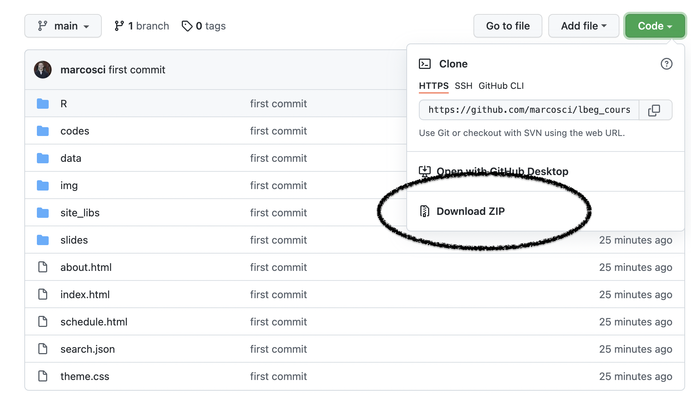
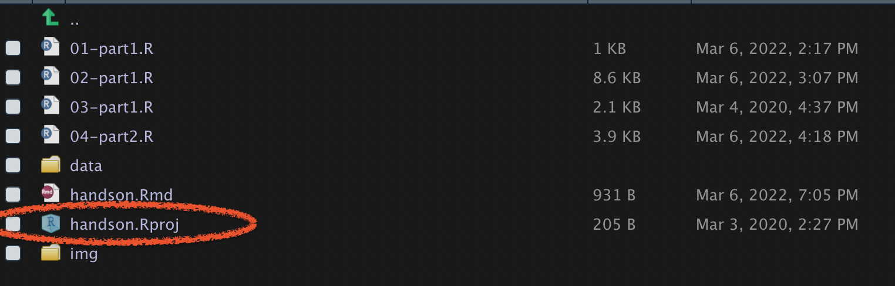

```{r setup, include=FALSE}
knitr::opts_chunk$set(echo = TRUE, warning = FALSE, message = FALSE, 
                      fig.width = 10, fig.height = 6, fig.retina = 2,
                      dev = "ragg_png", res = 1000)
```

## Kickoff

### Setup

### Kurs Material

* Downloaded das [Repository](https://github.com/marcosci/lbeg_course).

```{r echo=FALSE, layout="l-body"}

```

* Öffnet das R Project: `handson/handson.Rproj`

```{r echo=FALSE , layout="l-body"}

```

* Öffnet das erste Skript: `01-part1.R`
* Macht euch mit RStudio vertraut: [Cheat Sheet](https://raw.githubusercontent.com/rstudio/cheatsheets/main/rstudio-ide.pdf)

