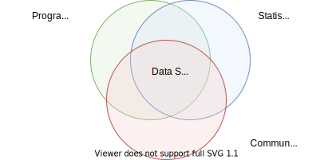

class: center
background-size: contain

```{r options, include = FALSE, purl=FALSE}
library(tidyverse)
hook_source <- knitr::knit_hooks$get('source')
knitr::knit_hooks$set(source = function(x, options) {
  x <- stringr::str_replace(x, "^[[:blank:]]?([^*].+?)[[:blank:]]*#<<[[:blank:]]*$", "*\\1")
  hook_source(x, options)
})

knitr::opts_chunk$set(
  echo = TRUE, 
  warning = FALSE, 
  message = FALSE, 
  collapse = TRUE,
  fig.height=6.3,
  fig.align = 'center',
  fig.retina = 3,
  dev = "ragg_png", 
  res = 1000
)

Sys.setlocale("LC_TIME", "C")

options(width = 80)
```

<br><br>
#  Räumliche Analysen mit <code style='color:#ebc500;'>R</code><br><b style='font-size:25pt;color:#a7a7a7;'>Part 1: Einführung in R</b>
<br><br><br><br><br><br><br>
#### Marco Sciaini<b style='color:#ccba56;font-weight:400;line-height:150%;'><br>Landesamt für Bergbau, Energie und Geologie<br>07. März, 2022</b><br>
</img>
---
## Wieso R?

</img>

--

</img>


--

</img>
 
---

## Marco Sciaini
<br>

+ Freelancer im Bereich Geodatenverarbeitung/Visualisierung

</img>

</img>

</img>

</img>

--

+ Landschaftsökologe
+ \> 10 Jahre Erfahrung mit R und räumlichen Daten
+ mehrere R Pakete auf CRAN

<br><br>
- [`r fontawesome::fa("twitter")` @shinysci](http://twitter.com/shinysci)  
- [`r fontawesome::fa("github")` @marcosci](http://github.com/marcosci)  
- [`r fontawesome::fa("link")` kaldera.dev](https://kaldera.dev)
- [`r fontawesome::fa("paper-plane")` marco@kaldera.dev](mailto:marco@kaldera.dev)

</img>

--

---

---
## Unser Kurs
+ Tag 1:
  + Part 1: Einführung in R und RStudio
     + ** R Kickoff**

---
### Sneak Peak #1
```{r eval=F, message=F, warning=FALSE, fig.width=4}
library(mapview)
library(sf)
library(dplyr)
franconia %>%
  mutate(count = length(st_contains(., breweries)),
         density = count / st_area(.)) %>%
  mapview(zcol = "density", legend = FALSE) 
```
<center>
```{r echo=F, message=F, warning=FALSE, fig.width=12, fig.height=5}
library(mapview)
library(sf)
library(dplyr)
franconia %>%
  mutate(count = length(st_contains(., breweries)),
         density = count / st_area(.)) %>%
  mapview(zcol = "density", legend = FALSE) 
```
</center>

---
#Sneak Peak #2

.pull-left[
### Base R
```{r eval=FALSE}
iris_sub <- iris[iris$Sepal.Width > 3.4 & iris$Sepal.Length > 2.7,]
iris_sp1 <- iris_sub[iris_sub$Species == "setosa",]
iris_sp2 <- iris_sub[iris_sub$Species == "virginica",]
fit_sp1 <- lm(Sepal.Width ~ Petal.Length, data = iris_sp1)
fit_sp2 <- lm(Sepal.Width ~ Petal.Length, data = iris_sp2)
par(mfrow = c(1,2))
plot(Sepal.Length ~ Petal.Width, data = iris_sp1) + 
abline(fit_sp1)
plot(Sepal.Length ~ Petal.Width, data = iris_sp2) + 
abline(fit_sp2)
```


]

.pull-right[
### Tidyverse
```{r eval=FALSE}
iris %>% 
  filter(Sepal.Width < 3.4 & Sepal.Length > 2.8) %>%
  ggplot(aes(x = Sepal.Width, y = Petal.Length)) +
  geom_point() +
  geom_smooth(method = lm) +
  facet_grid(. ~ Species)
```
]

---
```{r eval=FALSE, fig.show="hold", out.width="50%"}
iris_sub <- iris[iris$Sepal.Width > 3.4 & iris$Sepal.Length > 2.7,]
iris_sp1 <- iris_sub[iris_sub$Species == "setosa",]
iris_sp2 <- iris_sub[iris_sub$Species == "virginica",]
fit_sp1 <- lm(Sepal.Width ~ Petal.Length, data = iris_sp1)
fit_sp2 <- lm(Sepal.Width ~ Petal.Length, data = iris_sp2)
par(mfrow = c(1,2))
plot(Sepal.Length ~ Petal.Width, data = iris_sp1) + 
abline(fit_sp1)
plot(Sepal.Length ~ Petal.Width, data = iris_sp2)+ 
abline(fit_sp2)
```

.pull-right[
```{r eval=FALSE, fig.show="hold", out.width="50%"}
library(dplyr)
library(ggplot2)
iris %>% 
  dplyr::filter(Sepal.Width < 3.4 & 
         Sepal.Length > 2.8,
         Species %in% c("setosa", "virginica") ) %>%
  ggplot(aes(x = Sepal.Width, y = Petal.Length)) +
  geom_point() +
  geom_smooth(method = lm) +
  facet_grid(. ~ Species)
```
]
---
# Was ist R?
<br><br><br><br><br><br><br>
+ Freie Programmiersprache
+ Plattformunabhängig
+ Designed für statistische Analysen jeglicher Art(räumliche Modelle, Machine Learning, Bayesian …)
+ Hauptnutzer im akademischen Umfeld
+ \> 15 000 Bibliotheken ("R Pakete")

<br><br>
Download: https://cloud.r-project.org

</img>

---
# Wo kommt R her?
<br><br><br><br><br><br><br><br><br>
+ Vor 26 Jahren von Ross Ihaka und Robert Gentleman (Univ. Auckland) entwickelt
+ Nachfolger von S
+ Wird jetzt von der R Core Foundation entwickelt

</img>

---

## Wie funktioniert R?

<br><br>
+ R kann interaktiv genutzt werden (interactive mode) oder durch
das Ausführen einer Datei.

+ .. wir werden R interkativ nutzen

</img>

---
## R Pakete

+ Sammlung von Code, die man in R als Bibliothek laden kann
+ Nicht ausschließlich R Code
+ Fokussiert auf ein Thema

.pull-left[
```{r eval = FALSE}
install.packages("terra")
```

</img>

]


.pull-right[
```{r eval = FALSE}
library("terra")
```
]

---
## R Pakete
<br><br><br><br>
.pull-left[
+ Taskviews:
  + [https://cran.r-project.org/web/views/](https://cran.r-project.org/web/views/)
  + Kollektion der wichtigsten Pakete zu einem gewissen Thema
]


.pull-right[
</img>
]

---
# R Repositories

CRAN:
+ Offizielles Repository für R, Netzwerk von ftp- und Webservern
+ R Foundation koordiniert CRAN
+ Community führt sehr rigorose Tests für neue Pakete durch

</img>

---
# andere Quellen

+ GitHub:
  + De facto Standard für Open-Source Projekte
  + `devtools::install_github()` installiert R Pakete von GitHub
+ Bioconductor: Themenspezifisches R Repository für Bioinformatik
+ rOpenSci: Themenspezifisches R Repository für reproduzierbare Wissenschaft

---
# RStudio

<br><br>
- Integrated development environment (IDE) für R
+ Entwickelt von RStudio Inc., einer kommerziellen Firma
+ Plattformunabhängig
+ Syntax highlighting, Code Vervollständigung und “smart indentation”
+ Integration von Version Control und Rmarkdown (Reports)
+ Erleichtert interaktive Datenanalysen
+ RStudio Projekte
+ Eingebautes Grafikfenster

> Download: [https://rstudio.com/products/rstudio/](https://rstudio.com/products/rstudio/)

> Mehr Infos: [https://support.rstudio.com/hc/en-us/sections/200107586-Using-RStudio](https://support.rstudio.com/hc/en-us/sections/200107586-Using-RStudio)

</img>

---
# R Community
+ Freundlicher Anlaufpunkt für Einstieg/Probleme
+ Sehr viel und gute Dokumentation
+ Konferenzen: useR!, WhyR?, conectaR, SatRdays, rstudio::conf
+ RLadies: 139 Standorte, 44 Länder, 39000 Mitglieder
+ \#rstats-Hashtag auf Twitter
+ Lokale R Meetups

</img>

---
</img>

---
</img>

---
# Hands-on #1

<br><br><br><br><br>
> .large[/handson/hands_on_rstudio]
