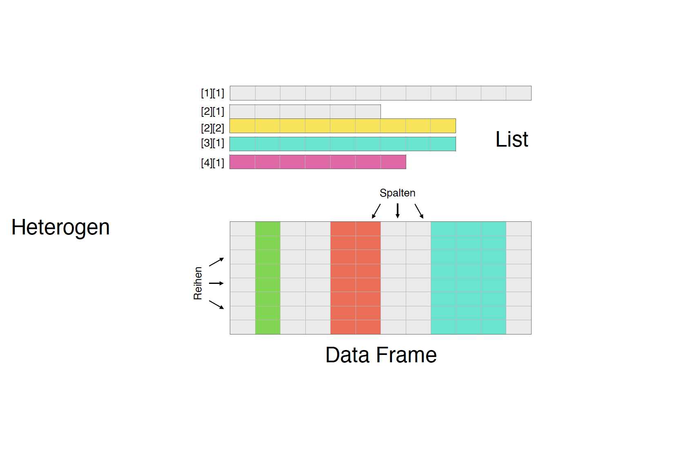

class: center
background-size: contain

```{r options, include = FALSE, purl=FALSE}
library(tidyverse)
hook_source <- knitr::knit_hooks$get('source')
knitr::knit_hooks$set(source = function(x, options) {
  x <- stringr::str_replace(x, "^[[:blank:]]?([^*].+?)[[:blank:]]*#<<[[:blank:]]*$", "*\\1")
  hook_source(x, options)
})

knitr::opts_chunk$set(
  echo = TRUE, 
  warning = FALSE, 
  message = FALSE, 
  collapse = TRUE,
  fig.height=6.3,
  fig.align = 'center',
  fig.retina = 3,
  dev = "ragg_png", 
  res = 1000
)

Sys.setlocale("LC_TIME", "C")

options(width = 80)
```

<br><br>
#  Räumliche Analysen mit <code style='color:#ebc500;'>R</code><br><b style='font-size:25pt;color:#a7a7a7;'>Part 1: Einführung in Progammieren mit R</b>
<br><br><br><br><br><br><br>
#### Marco Sciaini<b style='color:#ccba56;font-weight:400;line-height:150%;'><br>Landesamt für Bergbau, Energie und Geologie<br>07. März, 2022</b><br>
</img>

---
## Unser Kurs
+ Tag 1:
  + Part 1: Einführung in R und RStudio
     + R Kickoff
     + **Einführung in Progammieren mit R**

---
# R Vokabular

- **Funktion**: `function(do_something)`

```{r eval=FALSE}
library(terra)
rast(data/dem.tif)
```

---
# R Vokabular

- **Zuweisung**: `variable <- function(do_something)`

```{r eval=FALSE}
library(terra)
dem <- rast(data/dem.tif)
```

---
# R Vokabular

- **Subsetting**: Auswahl einer Stichprobe aus den Daten über einen Index

```{r eval=FALSE}
dem[30:40, 30:40]
```

> Index: Zahl, die das Subsetting spezifiziert, startet in R bei 1 (bei anderen Programmiersprachen ist die 0 üblich)

---
# Datentypen in R

.pull-left[
```{r}
numbers <- c(1, 0, 1)
class(numbers)
numbers
```

```{r}
characters <- c('1', '0', "1")
class(characters)
characters
```
]
-- 
.pull-right[
```{r}
factors <- as.factor(c(1, 0, 1))
class(factors)
factors
```

```{r}
logicals <- c(TRUE, FALSE, TRUE)
class(logicals)
logicals
```
]

---
# Datenstrukturen in R

--

</img>

---

```{r echo=FALSE, out.extra='align:center;', fig.retina=1}

```

---

```{r echo=FALSE, out.extra='align:center;', fig.retina=3}

```

---

```{r echo=FALSE, out.extra='align:center;', fig.retina=3}

```


---

```{r echo=FALSE, out.extra='align:center;', fig.retina=3}

```


---

```{r echo=FALSE, out.extra='align:center;', fig.retina=3}

```

---

```{r echo=FALSE, out.extra='align:center;', fig.retina=3}

```

---
# Datentypen und -strukturen in R

## Vektoren

.pull-left[
```{r eval=FALSE}
dbl_var <- c(1, 2.5, 4.5)
dbl_var <- c(1L, 6L, 10L)
lgl_var <- c(TRUE, FALSE)
chr_var <- c("these are", "some strings")
```
]

.pull-right[
```{r echo=FALSE, out.extra='align:center;', fig.retina=3}

```
]

---
# Datentypen und -strukturen in R

## Listen

```{r}
our_first_list <- list(dbl_var = c(1, 2.5, 4.5),
                       dbl_var = c(1L, 6L, 10L),
                       lgl_var = c(TRUE, FALSE),
                       chr_var = c("these are", "some strings"))

our_first_list
```

---
# Datentypen und -strukturen in R

## Dataframes / tibbles

.pull-left[
### Dataframe
```{r}
mtcars
```
]

.pull-right[
### tibble
```{r}
tibble(mtcars)
```
]


---
# Datentypen und -strukturen in R

## Dataframes / tibbles

```{r echo=FALSE, out.extra='align:center;', fig.retina=2}

```

---
# Style Guide

```{r echo=FALSE, out.extra='align:center;', fig.retina=3}

```

> “Good coding style is like correct punctuation: you can manage without it, butitsuremakesthingseasiertoread.” (Hadley Wickham)

---
# Style Guide

.pull-left[
```{r eval=FALSE}
# Gut
fit_models.R
utility_functions.R

# Schlecht
fit models.R
foo.r
stuff.r
```
]

--

.pull-right[
```{r eval=FALSE}
# Gut
day_one
day_1

# Schlecht
DayOne
dayone
```
]


---
# Style Guide

.pull-left[
```{r eval=FALSE}
# Gut
x[, 1]

# Schlecht
x[,1]
x[ ,1]
x[ , 1]
```
]

--

.pull-right[
```{r eval=FALSE}
# Gut
mean(x, na.rm = TRUE)

# Schlecht
mean (x, na.rm = TRUE)
mean( x, na.rm = TRUE )
```
]

---
# Pipe `%>%`

* `magrittr` Paket
* verhindert das Verschachteln von Funktionen
  * Lesefluss von Links nach Rechts
* vermindert das Zwischenspeichern von Objekten
* Plug & Play von zusätzlichen Schritten

--
<br><br><br><br>
- `x %>%` f ist äquivalent zu `f(x)`
- `x %>% f(y)` ist äquivalent zu `f(x, y)`
- `x %>% f %>% g %>% h` ist äquivalent zu `h(g(f(x)))`

---
# Pipe `%>%`

### Real World Beispiel

.pull-left[
```{r eval=FALSE}
the_data <- read.csv("path_to_data.csv") %>% 
  filter(variable_a > x) %>% 
  head(100)
```
]

.pull-right[
```{r eval=FALSE}
the_data <- read.csv("path_to_data.csv") %>% 
  filter(variable_a > x) %>% 
*  filter(!is.na(variable_c)) %>% 
  head(100)
```
]

---
# Hands-on #2

<br><br><br><br><br>
> <large>.large[/handson/hands_on_intro]</large>