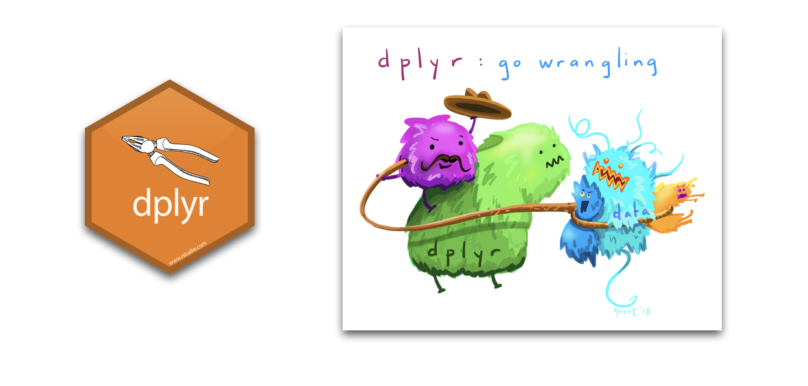
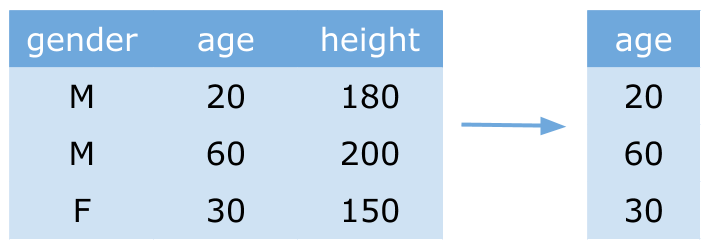
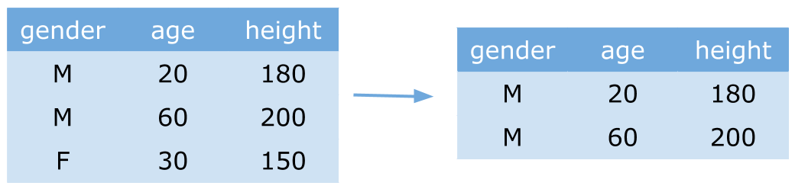
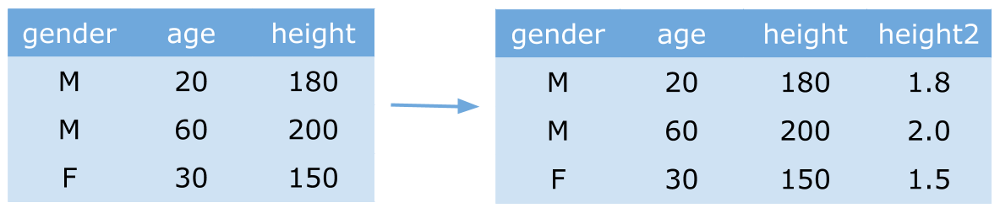
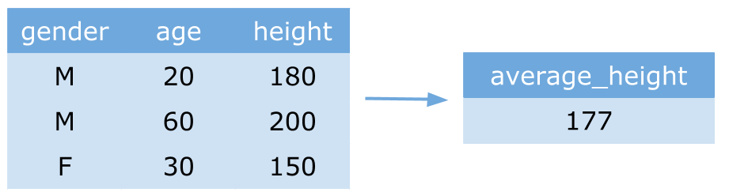
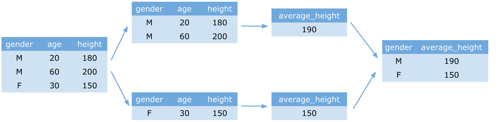

class: center
background-size: contain

```{r options, include = FALSE, purl=FALSE}
library(tidyverse)
hook_source <- knitr::knit_hooks$get('source')
knitr::knit_hooks$set(source = function(x, options) {
  x <- stringr::str_replace(x, "^[[:blank:]]?([^*].+?)[[:blank:]]*#<<[[:blank:]]*$", "*\\1")
  hook_source(x, options)
})

knitr::opts_chunk$set(
  echo = TRUE, 
  warning = FALSE, 
  message = FALSE, 
  collapse = TRUE,
  fig.height=6.3,
  fig.align = 'center',
  fig.retina = 3,
  dev = "ragg_png", 
  res = 1000
)

Sys.setlocale("LC_TIME", "C")

options(width = 80)
```

<br><br>
#  Räumliche Analysen mit <code style='color:#ebc500;'>R</code><br><b style='font-size:25pt;color:#a7a7a7;'>Part 1: Datenverarbeitung in R</b>
<br><br><br><br><br><br><br>
#### Marco Sciaini<b style='color:#ccba56;font-weight:400;line-height:150%;'><br>Landesamt für Bergbau, Energie und Geologie<br>07. März, 2022</b><br>
</img>

---
## Unser Kurs

+ Part 1: Einführung in R und RStudio
     + R Kickoff
     + Einführung in Progammieren mit R
     + **Datenverarbeitung in R**
     + Kontrollstrukturen

---
class: center
# `dplyr` - The grammar of data manipulation

```{r echo=FALSE, out.extra='align:center;', fig.retina=3}

```

---
# `dplyr` - Walkthrough

#### Die wichtigsten Funktionen

+ select()
+ filter()
+ mutate()
+ arrange()
+ summarise()
+ group_by()

---
# `dplyr` - Walkthrough

#### Die wichtigsten Funktionen

+ **select()**: selektieren von Spalten (Variablen)
+ filter()
+ mutate()
+ arrange()
+ summarise()
+ group_by()

</img>

.pull-right[
```{r}
data = data.frame(gender = c("M", "M", "F"),
                  age = c(20, 60, 30),
                  height = c(180, 200, 150))

data %>% select(age)
```

]

---
# `dplyr` - Walkthrough

#### Die wichtigsten Funktionen

+ select()
+ **filter()**: bildet Untermenge aus den Reihen (Daten)
+ mutate()
+ arrange()
+ summarise()
+ group_by()

</img>

.pull-right[
```{r}
data = data.frame(gender = c("M", "M", "F"),
                  age = c(20, 60, 30),
                  height = c(180, 200, 150))

data %>% filter(height > 160)
```

]

# `dplyr` - Walkthrough

#### Die wichtigsten Funktionen

- **filter()**: bildet Untermenge aus den Reihen (Daten)

<br><br>

- Bedingung: `TRUE/FALSE`
+ Vergleichsoperatoren: `>`, `>=`, `<=`, `<`, `==` (equal), `!=` (not equal)
+ `between()`, `near()`, `is.na()`
+ Operatoren: `&` (und), `|` (or), `!` (not)
+ `%in%` (identifiziert ob ein Element in einem Vektor ist)


---
# `dplyr` - Walkthrough

#### Die wichtigsten Funktionen

+ select()
+ filter()
+ **mutate()**: verändert Variablen oder fügt neue hinzu
+ arrange()
+ summarise()
+ group_by()

</img>

.pull-right[
```{r}
data = data.frame(gender = c("M", "M", "F"),
                  age = c(20, 60, 30),
                  height = c(180, 200, 150))

data %>% mutate(height2 = height / 100)
```

]


---
# `dplyr` - Walkthrough

#### Die wichtigsten Funktionen

+ select()
+ filter()
+ mutate()
+ **arrange()**: Datensatz sortieren
+ summarise()
+ group_by()

</img>

.pull-right[
```{r}
data = data.frame(gender = c("M", "M", "F"),
                  age = c(20, 60, 30),
                  height = c(180, 200, 150))

data %>% arrange(height)
```

]


---
# `dplyr` - Walkthrough

#### Die wichtigsten Funktionen

+ select()
+ filter()
+ mutate()
+ arrange()
+ **summarise()**:Daten zusammenfassen
+ group_by()

</img>

.pull-right[
```{r}
data = data.frame(gender = c("M", "M", "F"),
                  age = c(20, 60, 30),
                  height = c(180, 200, 150))

data %>% summarise(average_height = mean(height))
```
]

---
# `dplyr` - Walkthrough

#### Die wichtigsten Funktionen

.pull-left[
+ select()
+ filter()
+ mutate()
+ arrange()
+ summarise()
+ **group_by()**: Daten gruppieren
]
.pull-right[
```{r}
data = data.frame(gender = c("M", "M", "F"),
                  age = c(20, 60, 30),
                  height = c(180, 200, 150))

data %>% group_by(gender) %>% summarise(average_height = mean(height))
```
]

</img>

---
# Hands-on #3

<br><br><br><br><br>
> <large>.large[/handson/hands_on_data_wrangling]</large>