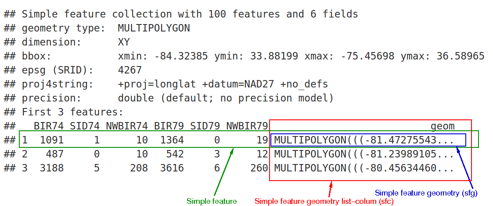

class: center
background-size: contain

```{r options, include = FALSE, purl=FALSE}
library(tidyverse)
library(sf)
hook_source <- knitr::knit_hooks$get('source')
knitr::knit_hooks$set(source = function(x, options) {
  x <- stringr::str_replace(x, "^[[:blank:]]?([^*].+?)[[:blank:]]*#<<[[:blank:]]*$", "*\\1")
  hook_source(x, options)
})

knitr::opts_chunk$set(
  echo = TRUE, 
  warning = FALSE, 
  message = FALSE, 
  collapse = TRUE,
  fig.height=6.3,
  fig.align = 'center',
  fig.retina = 3,
  dev = "ragg_png", 
  res = 1000
)

Sys.setlocale("LC_TIME", "C")

options(width = 80)
```

<br><br>
#  Räumliche Analysen mit <code style='color:#ebc500;'>R</code><br><b style='font-size:25pt;color:#a7a7a7;'>Part 2: Erste räumliche Gehversuche</b>
<br><br><br><br><br><br><br>
#### Marco Sciaini<b style='color:#ccba56;font-weight:400;line-height:150%;'><br>Landesamt für Bergbau, Energie und Geologie<br>07. März, 2022</b><br>
</img>

---
## Unser Kurs
Part 1: Einführung in R und RStudio
     + R Kickoff
     + Einführung in Progammieren mit R
     + Datenverarbeitung in R
     + Kontrollstrukturen

+ Part 2: Einführung in räumliche Daten und R
  + **Erste räumliche Gehversuche**

---
class: center
# `R's räumliches Ökosystem`

```{r echo=FALSE, out.extra='align:center;', fig.retina=3.2}

```

---
class: center
# `R's räumliches Ökosystem`

```{r echo=FALSE, out.extra='align:center;', fig.retina=1.5}

```

---
class: center
# `R's räumliches Ökosystem`

```{r echo=FALSE, out.extra='align:center;', fig.retina=7.5}
knitr::include_graphics("img/spatialmapping4.png")
```

---
# Geschichtsstunde #rspatial

- R hat räumliche Pakete seit 2000
  - S, der Vorgänger von R, hatte bereits Anfang der 90er Support für räumliche Daten
- rgdal (2003) > sp (2005) > raster(2010)
- Seit 2014 gemeinsamer Umbruch mit dplyr hinzu *"tidy data"*

---
class: center
```{r echo=FALSE, out.extra='align:center;', fig.retina=.5}

```

---
# Geodatenformate in R

> Wir fokussieren uns auf sf, terra und stars


- sf, terra und stars bieten einen einheitlichen Ansatz der Geodatenverarbeitung
- Interoperatibel
- Lösen Dschungel an R Paketen ab, die vorher gebräuchlich waren

---
## Projektion - wo liegen meine Daten?

### Coordinate Reference System (CRS)

- Meistens 2D Repräsentation (Koordinaten) von einem Standort
  - Verkettung von Koordinaten ergibt komplexere Geometrien

> Beispiel: Zentroid London 

.pull-left[
> ‘lon/lat’ CRS: <br>
> `c(-0.1, 51.5)`

```{r echo=FALSE, out.extra='align:center;', fig.retina=2}
knitr::include_graphics("img/crs.png")
```

]


.pull-right[
> ‘Easting/Northing’ CRS: <br>
> `c(530000, 180000)`

```{r echo=FALSE, out.extra='align:center;', fig.retina=2.3}
knitr::include_graphics("img/crs2.png")
```
]


---
### Vektordaten

- `sf` hat 2016 den *simple features* Standard in R implementiert

```{r echo=FALSE, out.extra='align:center;', fig.retina=2.5}

```

---
# `sf` - simple features

```{r echo=FALSE, out.extra='align:center;', fig.retina=2.5}

```

---

- point:               `st_point()`
- linestring:          `st_linestring()`
- polygon:             `st_polygon()`
- multipoint:          `st_multipoint()`
- multilinestring:     `st_multilinestring()`
- multipolygon:        `st_multipolygon()`
- geometry collection: `st_geometrycollection()`

```{r}
st_point(c(5, 2))
```

```{r}
multipoint_matrix = rbind(c(5, 2), c(1, 3), c(3, 4), c(3, 2))
st_multipoint(multipoint_matrix)
```

```{r}
linestring_matrix = rbind(c(1, 5), c(4, 4), c(4, 1), c(2, 2), c(3, 2))
st_linestring(linestring_matrix)
```


---
# `sf` - simple features

```{r echo=FALSE, out.extra='align:center;', fig.retina=2}

```

---
# `sf` - simple features
.pull-left[
| **Klasse** | **Hierarchie**   | **Information** |
|------------|------------------|-----------------|
| sfg        | Geometrie        | Typ, Koordinate |
| sfc        | Geometrie Spalte | sfg + CRS       |
| sf         | Layer            | sfc + Metadaten |
]

.pull-right[
```{r echo=FALSE, out.extra='align:center;', fig.retina=2}

```
]


---

```{r}
library(sf)
library(spData)
class(world)
world
```

---
# Schneller Blick auf die Daten
```{r}
plot(world["lifeExp"])
```

---
# "Gewohntes" Arbeiten mit Tabellen
```{r}
summary(world["lifeExp"])
```

---
# "Gewohntes" Arbeiten mit Tabellen
```{r fig.retina=4}
library(dplyr)
world %>% 
  filter(lifeExp > 78) %>% 
  select(lifeExp, geom) %>% 
  plot()
```

---
# Einfaches indizieren
```{r}
world_mini = world[1:2, 1:3]
world_mini
```

---
# Simple Karten
```{r}
world_asia = world[world$continent == "Asia", ]
asia = st_union(world_asia)
plot(world["pop"], reset = FALSE)
plot(asia, add = TRUE, col = "red")
```
---

```{r}
plot(world["continent"], reset = FALSE)
cex = sqrt(world$pop) / 10000
world_cents = st_centroid(world, of_largest = TRUE)
plot(st_geometry(world_cents), add = TRUE, cex = cex)
```
---

```{r}
india = world[world$name_long == "India", ]
plot(st_geometry(india), expandBB = c(0, 0.2, 0.1, 1), col = "gray", lwd = 3)
plot(world_asia[0], add = TRUE)
```

---
# Geodaten importieren

```{r}
# load geojson file
seismic <- st_read("data/seismic.geojson")

# examine the data
glimpse(seismic)
```


---
# Geodaten exportieren

```{r}
# Geopackage
write_sf(seismic, "data/seismic.gpkg")

# Shapefile
write_sf(seismic, "data/seismic.shp")
```

---
# Hands-on #4

<br><br><br><br><br>
> <large>.large[/handson/hands_on_intro]</large>
