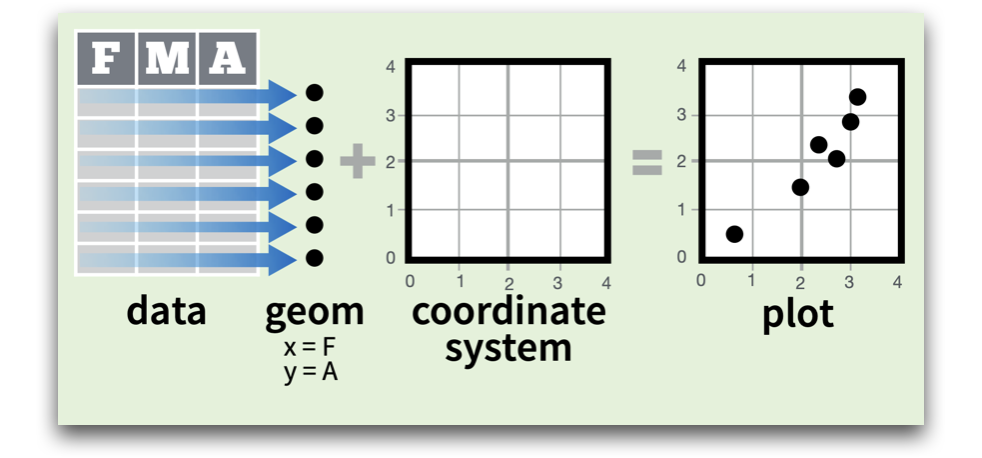
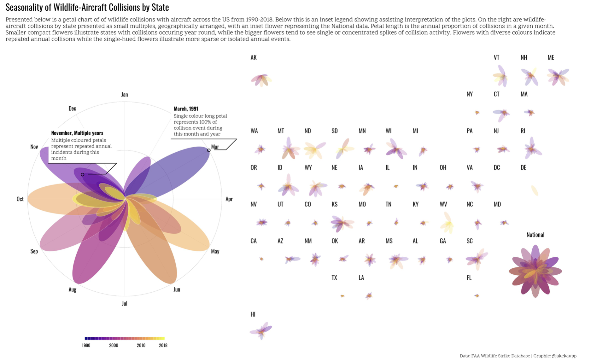

class: center
background-size: contain

```{r options, include = FALSE, purl=FALSE}
library(tidyverse)
library(sf)
library(scales)

seismic <- st_read("data/seismic.geojson")

seismic <- seismic %>%
  mutate(ValueRange = factor(ValueRange,
                             levels = c("< 1","1 - 2","2 - 5","5 - 10","10 - 14")))

hook_source <- knitr::knit_hooks$get('source')
knitr::knit_hooks$set(source = function(x, options) {
  x <- stringr::str_replace(x, "^[[:blank:]]?([^*].+?)[[:blank:]]*#<<[[:blank:]]*$", "*\\1")
  hook_source(x, options)
})

knitr::opts_chunk$set(
  echo = TRUE, 
  warning = FALSE, 
  message = FALSE, 
  collapse = TRUE,
  fig.height=6.3,
  fig.align = 'center',
  fig.retina = 3,
  dev = "ragg_png", 
  res = 1000
)

Sys.setlocale("LC_TIME", "C")

options(width = 80)
```

<br><br>
#  Räumliche Analysen mit <code style='color:#ebc500;'>R</code><br><b style='font-size:25pt;color:#a7a7a7;'>Part 2: Geometrische Operationen mit Vektoren</b>
<br><br><br><br><br><br><br>
#### Marco Sciaini<b style='color:#ccba56;font-weight:400;line-height:150%;'><br>Landesamt für Bergbau, Energie und Geologie<br>07. März, 2022</b><br>
</img>

---
## Unser Kurs
+ Part 1: Einführung in R und RStudio
     + R Kickoff
     + Einführung in Progammieren mit R
     + Datenverarbeitung in R
     + Kontrollstrukturen

+ Part 2: Einführung in räumliche Daten und R
  + Erste räumliche Gehversuche
  + **Geometrische Operationen mit Vektoren**

---
# Geometrische Operationen mit Vektoren

#### Wir haben uns bisher angeschaut:
- wie räumliche Daten aufgebaut sind (z.B. `sfg`, `sfc`, `sf`)
- wie wir mit den nicht räumlichen Attributen arbeiten

```{r echo=FALSE, out.extra='align:center;', fig.retina=3.2}
knitr::include_graphics("img/ah_sf.png")
```

---
# Unary Operationen
## Simplifizieren
```{r}
county <- st_read("data/USA_2_GADM_fips.shp")
california <- county[county$NAME_1 == "California", ]
california_simp = st_simplify(california, dTolerance = 20000)
object.size(st_geometry(california))
object.size(st_geometry(california_simp))
```

---
```{r fig.dim=c(12,9), out.extra='margin-bottom:50px;'}
par(mfrow=c(1,2))
plot(st_geometry(california))
plot(st_geometry(california_simp))
```


---
# Unary Operationen
## Zentroide
.pull-left[
```{r eval=FALSE}
# Unary Operationen
## Zentroide
california_simp_centroid <- st_centroid(california_simp)
```
]

.pull-right[
```{r echo=FALSE}
# Unary Operationen
## Zentroide
california_simp_centroid <- st_centroid(california_simp)
plot(st_geometry(california_simp_centroid))
```
]

---
# Unary Operationen
## Buffer

```{r, eval = FALSE, fig.width = 5}
california_simp_buff_5km = st_buffer(california_simp_centroid, dist = 5000)
california_simp_buff_50km = st_buffer(california_simp_centroid, dist = 50000)
plot(st_geometry(california_simp_buff_50km), col = alpha("#6d5558", 0.3))
plot(st_geometry(california_simp_buff_5km), add = TRUE, col = "#b01225")
```
---
# Unary Operationen
## Buffer

```{r, echo = FALSE, fig.width = 5}
california_simp_buff_5km = st_buffer(california_simp_centroid, dist = 5000)
california_simp_buff_50km = st_buffer(california_simp_centroid, dist = 50000)
plot(st_geometry(california_simp_buff_50km), col = alpha("#6d5558", 0.3))
plot(st_geometry(california_simp_buff_5km), add = TRUE, col = "#b01225")
```

---
## Clipping

```{r}
b = st_sfc(st_point(c(0, 1)), st_point(c(1, 1))) 
b = st_buffer(b, dist = 1) 
plot(b, border = "grey")
text(x = c(-0.5, 1.5), y = 1, labels = c("x", "y"), cex = 3)
```

---
```{r}
x = b[1]
y = b[2]
x_and_y = st_intersection(x, y)
plot(b, border = "grey")
plot(x_and_y, col = "lightgrey", border = "grey", add = TRUE)
```

---
class: center
```{r echo=FALSE, layout="l-body"}
knitr::include_graphics("img/spatial_intersections.png")
```


---
# Spatial Subsetting

.pull-left[
```{r echo=FALSE, layout="l-body"}
knitr::include_graphics("img/spatial-subset.png")
```
]

.pull-right[
```{r echo=FALSE, layout="l-body"}
bb = st_bbox(st_union(x, y))
box = st_as_sfc(bb)
set.seed(2017)
p = st_sample(x = box, size = 10)
x_and_y = st_intersection(x, y)
st_intersection(p, x_and_y)
```
]

---
# Geometry unions

```{r}
st_union(california) %>% st_geometry %>% plot()
```

--- 
# Casting von Geometrietypen
```{r}
multipoint = st_multipoint(matrix(c(1, 3, 5, 1, 3, 1), ncol = 2))
linestring = st_cast(multipoint, "LINESTRING")
polygon = st_cast(multipoint, "POLYGON")
par(mfrow = c(1,3))
plot(multipoint)
plot(linestring)
plot(polygon)
```
---

# ggplot2

- Zentraler Bestandteil des Tidyverse
- Explorative Datenanalyse (EDA)
- Erstellen von Grafiken zur Kommunikation von Resultaten
- Basierend auf der "Grammar of Graphics" (Wilkinson, 2005)

```{r echo=FALSE}

```

---
```{r echo=FALSE}

```

---

```{r}
ggplot() +
  geom_sf(data = seismic,
          aes(fill = ValueRange), 
          size = 0) +
  scale_fill_brewer(palette = "Reds",
                    name = "% chance") +
  coord_sf(crs = "EPSG:5070",
           default_crs = "EPSG:4326") +
  theme_void()
```

---
# Hands-on #8

<br><br><br>
> <large>.large[/handson/hands_on_ggplot]</large>

<br><br>
> <large>.large[/handson/hands_on_sf_advanced]</large>
