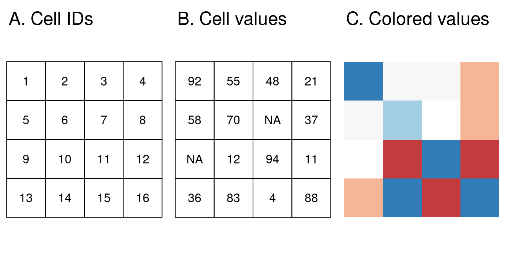
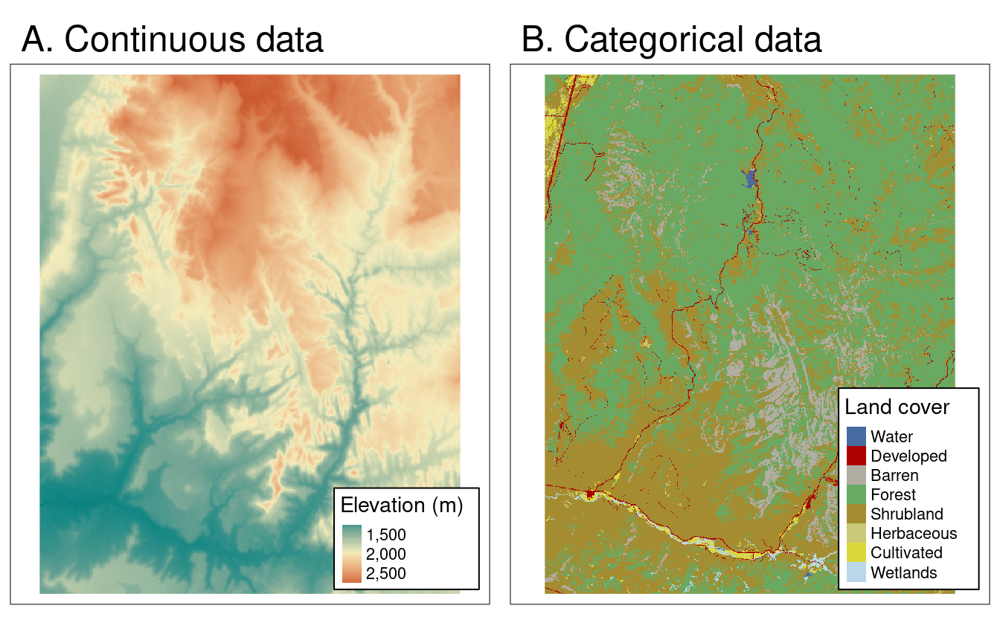
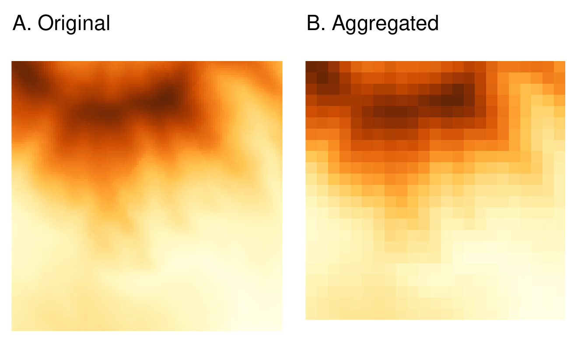
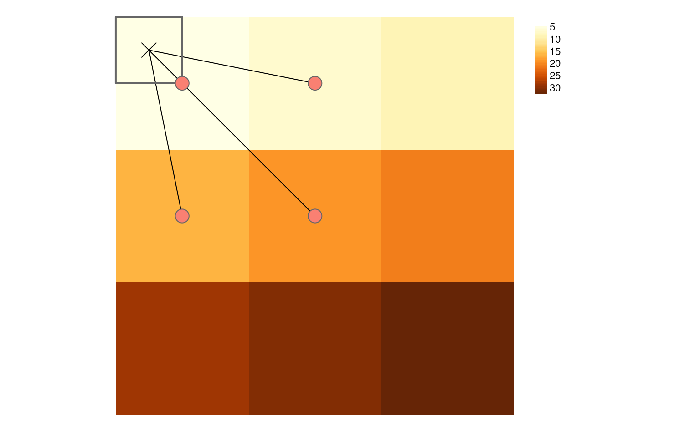

class: center
background-size: contain

```{r options, include = FALSE, purl=FALSE}
library(tidyverse)
library(sf)
library(scales)
library(terra)

seismic <- st_read("data/seismic.geojson")

seismic <- seismic %>%
  mutate(ValueRange = factor(ValueRange,
                             levels = c("< 1","1 - 2","2 - 5","5 - 10","10 - 14")))

hook_source <- knitr::knit_hooks$get('source')
knitr::knit_hooks$set(source = function(x, options) {
  x <- stringr::str_replace(x, "^[[:blank:]]?([^*].+?)[[:blank:]]*#<<[[:blank:]]*$", "*\\1")
  hook_source(x, options)
})

knitr::opts_chunk$set(
  echo = TRUE, 
  warning = FALSE, 
  message = FALSE, 
  collapse = TRUE,
  fig.height=6.3,
  fig.align = 'center',
  fig.retina = 3,
  dev = "ragg_png", 
  res = 1000
)

Sys.setlocale("LC_TIME", "C")

options(width = 80)
```

<br><br>
#  Räumliche Analysen mit <code style='color:#ebc500;'>R</code><br><b style='font-size:25pt;color:#a7a7a7;'>Part 2: Geometrische Operationen mit Rasterdaten</b>
<br><br><br><br><br><br><br>
#### Marco Sciaini<b style='color:#ccba56;font-weight:400;line-height:150%;'><br>Landesamt für Bergbau, Energie und Geologie<br>07. März, 2022</b><br>
</img>

---
## Unser Kurs
+ Part 1: Einführung in R und RStudio
     + R Kickoff
     + Einführung in Progammieren mit R
     + Datenverarbeitung in R
     + Kontrollstrukturen

+ Part 2: Einführung in räumliche Daten und R
  + Erste räumliche Gehversuche
  + Geometrische Operationen mit Vektoren
  + **Geometrische Operationen mit Rasterdaten**

---
# Geometrische Operationen mit Rasterdaten

```{r echo=FALSE}

```

---
```{r echo=FALSE}

```
---
# R Pakete für Rasterdaten

> raster -> terra + stars

.pull-left[
### terra
- Eher gedacht für grundlegende Arbeiten mit Rasterdaten
]

.pull-right[
### stars
- Implementiert  raster data cubes 
  - Damit eher für Cloud Computation gedacht
]

---
# `terra`

```{r echo=FALSE}
library(terra)
test_raster <- rast(ncol=10, nrow=10, xmin=-150, xmax=-80, ymin=20, ymax=60)
test_raster
```
---
# `terra`

```{r echo=FALSE}
library(terra)
test_raster[] <- rnorm(100)
plot(test_raster)
```

---
# `terra`

```{r echo=FALSE}
raster_filepath = system.file("raster/srtm.tif", package = "spDataLarge")
my_rast = rast(raster_filepath)
class(my_rast)
```

---
# `terra`

```{r echo=FALSE}
plot(my_rast)
```

---
# Raster Klassen
```{r}
my_rast
```

---
# Raster Klassen
```{r}
multi_raster_file = system.file("raster/landsat.tif", package = "spDataLarge")
multi_rast = rast(multi_raster_file)
multi_rast
```
```{r}
nlyr(multi_rast)
```


---
# Raster Layer
```{r}
multi_rast3 = subset(multi_rast, 3)
multi_rast4 = subset(multi_rast, "landsat_4")
par(mfrow = c(1,2))
plot(multi_rast3)
plot(multi_rast4)
```

---
# Raster Layer
```{r}
(recombined_raster <- c(multi_rast3, multi_rast4))
```

---
# Raster Manipulation

```{r}
elev = rast(nrows = 6, ncols = 6, resolution = 0.5, 
            xmin = -1.5, xmax = 1.5, ymin = -1.5, ymax = 1.5,
            vals = 1:36)
plot(elev)
```

---
# Raster Subsetting
.pull-left[
```{r}
# Reihe 1, Spalte 1
elev[1, 1]
# Zelle mit ID 1
elev[1]
```
]

.pull-right[
```{r}
elev[1, 1] = 0
elev[]
```
]

---
# Raster Übersicht
.pull-left[
```{r}
# summary
summary(my_rast)
# sd
global(my_rast, sd)
```
]

.pull-right[
```{r}
# histogram
hist(my_rast)
```
]

---
# `Map algebra`

```{r}
r1 <- elev + elev
r2 <- elev^2
r3 <- log(elev)
r4 <- elev > 5
```

```{r, echo=FALSE, fig.align='center'}
par(mfrow = c(1,4))
plot(r1)
plot(r2)
plot(r3)
plot(r4)
```

---
# Focal / Moving window Funktionen

```{r}
r_focal = focal(elev, w = matrix(1, nrow = 3, ncol = 3), fun = min)
```

```{r echo=FALSE, fig.height=6}
knitr::include_graphics("img/focal_example.png")
```


---
# Zonale Funktionen

> basieren auf zweitem Raster, dass Zonen definiert

.pull-left[
```{r fig.dim=c(4, 3)}
grain_order = c("clay", "silt", "sand")
grain_char = sample(grain_order, 36, replace = TRUE)
grain_fact = factor(grain_char, levels = grain_order)
grain = rast(nrows = 6, ncols = 6, resolution = 0.5, 
             xmin = -1.5, xmax = 1.5, ymin = -1.5, ymax = 1.5,
             vals = grain_fact)
plot(grain)
```
]


.pull-right[
```{r}
r_zonal = zonal(elev, grain, fun = "mean")
r_zonal
```
]

---
# `Aggregation` und Disaggregation
```{r}
dem = rast(system.file("raster/dem.tif", package = "spDataLarge"))
dem_agg = aggregate(dem, fact = 5, fun = mean)
```

```{r echo=FALSE}

```

---
# Aggregation und `Disaggregation`
```{r}
dem_disagg = disagg(dem_agg, fact = 5, method = "bilinear")
```

```{r echo=FALSE}

```
