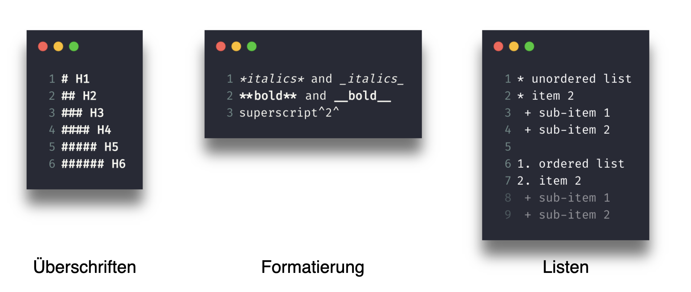

class: center
background-size: contain

```{r options, include = FALSE, purl=FALSE}
library(tidyverse)
library(sf)
library(scales)
library(terra)

seismic <- st_read("data/seismic.geojson")

seismic <- seismic %>%
  mutate(ValueRange = factor(ValueRange,
                             levels = c("< 1","1 - 2","2 - 5","5 - 10","10 - 14")))

hook_source <- knitr::knit_hooks$get('source')
knitr::knit_hooks$set(source = function(x, options) {
  x <- stringr::str_replace(x, "^[[:blank:]]?([^*].+?)[[:blank:]]*#<<[[:blank:]]*$", "*\\1")
  hook_source(x, options)
})

knitr::opts_chunk$set(
  echo = TRUE, 
  warning = FALSE, 
  message = FALSE, 
  collapse = TRUE,
  fig.height=6.3,
  fig.align = 'center',
  fig.retina = 3,
  dev = "ragg_png", 
  res = 1000
)

Sys.setlocale("LC_TIME", "C")

options(width = 80)
```

<br><br>
#  Räumliche Analysen mit <code style='color:#ebc500;'>R</code><br><b style='font-size:25pt;color:#a7a7a7;'>Part 3: Reproduzierbares Arbeiten mit Markdown</b>
<br><br><br><br><br><br><br>
#### Marco Sciaini<b style='color:#ccba56;font-weight:400;line-height:150%;'><br>Landesamt für Bergbau, Energie und Geologie<br>07. März, 2022</b><br>
</img>

---
## Unser Kurs
+ Part 1: Einführung in R und RStudio
     + R Kickoff
     + Einführung in Progammieren mit R
     + Datenverarbeitung in R
     + Kontrollstrukturen

+ Part 2: Einführung in räumliche Daten und R
  + Erste räumliche Gehversuche
  + Geometrische Operationen mit Vektoren
  + Geometrische Operationen mit Rasterdaten

+ Part 3: Fortgeschrittene Themen zur räumlichen Datenverarbeitung
  + **Reproduzierbares Arbeiten mit Markdown**
  
---
# Reproduzierbares Arbeiten mit Markdown

- Wissenschaftler schreiben sehr viele Berichte
  - … diese werden dann oft mit Kollegen geteilt
  - … welche die Ergebnisse nachvollziehen wollen/müssen
- … und eventuell will/muss selbst nach einiger Zeit Analysen erneut laufen lassen

```{r echo=FALSE}

```


---
# rmarkdown - Reproduzierbares Arbeiten mit R

- R Package zum Schreiben von Reports mit Markdown

- "computational documents" - Vernetzung von Text und Code

<br><br><br>
> - Wissenschaftler schreiben sehr viele Berichte
>  - … diese werden dann oft mit Kollegen geteilt `r fontawesome::fa("check")`
>  - … welche die Ergebnisse nachvollziehen wollen/müssen `r fontawesome::fa("check")`
> - … und eventuell will/muss selbst nach einiger Zeit Analysen erneut laufen lassen `r fontawesome::fa("check")`

</img>


---
# rmarkdown - Reproduzierbares Arbeiten mit R
```{r echo=FALSE}
knitr::include_graphics("img/rmarkdown_intro.png")
```

---
# rmarkdown - Syntax

```{r echo=FALSE, fig.retina=1}

```


---
# rmarkdown - Formatierung

```{r echo=FALSE, fig.retina=1}

```

---
# rmarkdown - Extras

```{r echo=FALSE, fig.retina=1}

```


---
# rmarkdown - Code Chuncks

.pull-left[
```{r eval=FALSE}
\```{r echo=FALSE}
plot(cars, pch = 18)
\```
```
]

.pull-right[
- `echo=FALSE`: Unterdrückt Code im finalen Dokument
- `results="hide"`: Zeigt nur Code im finalen Dokument, aber lässt Chunk laufen
- `eval=FALSE`: Code Chunk wird nicht evaluiert
- `warning=FALSE` und message=FALSE unterdrücken Warnungen/Messages
- `fig.height`, fig.width kontrolliert Größe der Plots (in inches).
- `fig.cap`: Fügt Bildunterschrift hinzu
]

---
# rmarkdown - Code Chuncks

.pull-left[
```{r echo=TRUE, eval=FALSE}
\```{r echo=FALSE}
plot(cars, pch = 18)
\```
```
]

.pull-right[
- `echo=FALSE`: Unterdrückt Code im finalen Dokument
- `results="hide"`: Zeigt nur Code im finalen Dokument, aber lässt Chunk laufen
- `eval=FALSE`: Code Chunk wird nicht evaluiert
- `warning=FALSE` und message=FALSE unterdrücken Warnungen/Messages
- `fig.height`, fig.width kontrolliert Größe der Plots (in inches).
- `fig.cap`: Fügt Bildunterschrift hinzu
]

</img>

---
# rmarkdown 

```{r echo=FALSE, fig.retina=2.5}

```

---
# rmarkdown 

```{r echo=FALSE, fig.retina=2.5}

```


---
# rmarkdown + pandoc

```{r echo=FALSE, fig.retina=2.5}

```

---
# Handson rmarkdown
<br><br><br><br>
> Rmarkdown Dokument erstellen und einige bisher erlernten Funktionen in Text einbetten. Entweder mit Daten aus den handsons, oder gerne auch mit eigenen Daten. (30 Minuten)
