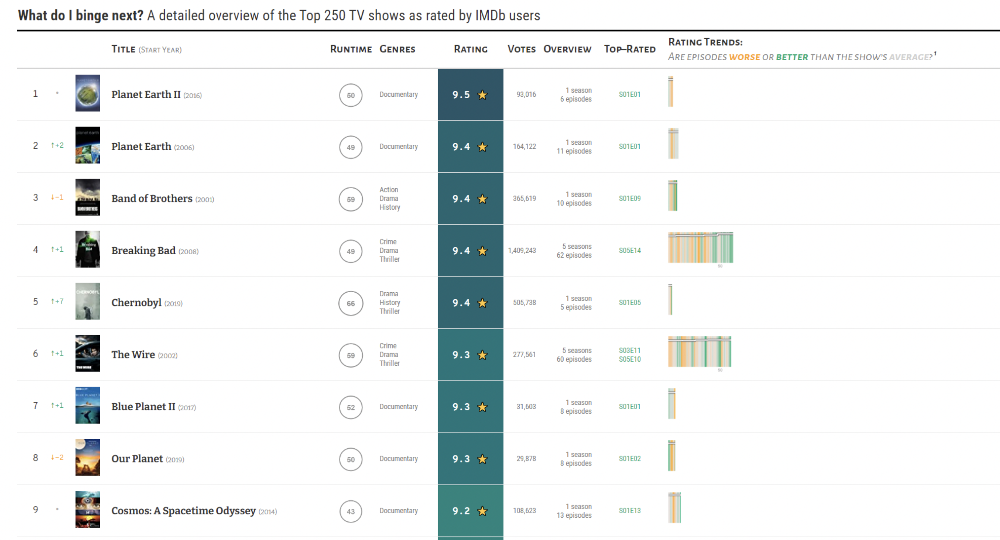

class: center
background-size: contain

```{r options, include = FALSE, purl=FALSE}
library(tidyverse)
library(sf)
library(scales)
library(terra)

seismic <- st_read("data/seismic.geojson")

seismic <- seismic %>%
  mutate(ValueRange = factor(ValueRange,
                             levels = c("< 1","1 - 2","2 - 5","5 - 10","10 - 14")))

hook_source <- knitr::knit_hooks$get('source')
knitr::knit_hooks$set(source = function(x, options) {
  x <- stringr::str_replace(x, "^[[:blank:]]?([^*].+?)[[:blank:]]*#<<[[:blank:]]*$", "*\\1")
  hook_source(x, options)
})

knitr::opts_chunk$set(
  echo = TRUE, 
  warning = FALSE, 
  message = FALSE, 
  collapse = TRUE,
  fig.height=6.3,
  fig.align = 'center',
  fig.retina = 3,
  dev = "ragg_png", 
  res = 1000
)

Sys.setlocale("LC_TIME", "C")

options(width = 80)
```

<br><br>
#  Räumliche Analysen mit <code style='color:#ebc500;'>R</code><br><b style='font-size:25pt;color:#a7a7a7;'>Part 3: gt - Tabellen in hübsch</b>
<br><br><br><br><br><br><br>
#### Marco Sciaini<b style='color:#ccba56;font-weight:400;line-height:150%;'><br>Landesamt für Bergbau, Energie und Geologie<br>07. März, 2022</b><br>
</img>

---
## Unser Kurs
+ Part 1: Einführung in R und RStudio
     + R Kickoff
     + Einführung in Progammieren mit R
     + Datenverarbeitung in R
     + Kontrollstrukturen

+ Part 2: Einführung in räumliche Daten und R
  + Erste räumliche Gehversuche
  + Geometrische Operationen mit Vektoren
  + Geometrische Operationen mit Rasterdaten

+ Part 3: Fortgeschrittene Themen zur räumlichen Datenverarbeitung
   + Reproduzierbares Arbeiten mit Markdown
  + Interaktives Arbeiten mit Markdown
  + Brückenschlagen mit R zu anderer GIS Software
  + future - Der einfache Weg in R zu parallelisieren
  + **gt - Tabellen in hübsch**

---
# gt - Tabellen in hübsch

```{r echo=FALSE, out.extra='align:center;', fig.retina=3}
knitr::include_graphics("img/gt_intro.svg")
```

---
# gt - Workflow

```{r echo=FALSE, out.extra='align:center;', fig.retina=3}
knitr::include_graphics("img/gt_workflow_diagram.svg")
```

---
# gt - Beispiel


```{r}
library(gt)
rock %>%
  head(5) %>% 
  gt() 
```

---
# gt - Beispiel

```{r echo=FALSE}
# Create a gt table based on a preprocessed `pizzaplace`
pizzaplace %>%
  dplyr::group_by(type, size) %>%
  dplyr::summarize(
    sold = n(),
    income = sum(price),
    .groups = "drop_last"
  ) %>%
  gt(rowname_col = "size") %>%
  tab_header(title = "Pizzas Sold in 2015") %>%
  fmt_number(
    columns = sold,
    decimals = 0,
    use_seps = TRUE
  ) %>%
  fmt_currency(
    columns = income,
    currency = "USD"
  ) %>%
  summary_rows(
    groups = TRUE,
    columns = sold,
    fns = list(TOTAL = "sum"),
    formatter = fmt_number,
    decimals = 0,
    use_seps = TRUE
  ) %>%
  summary_rows(
    groups = TRUE,
    columns = income,
    fns = list(TOTAL = "sum"),
    formatter = fmt_currency,
    currency = "USD"
  ) %>%
  tab_options(
    summary_row.background.color = "#ACEACE",
    row_group.background.color = "#FFEFDB"
  )
```

---
# gt - Beispiel

```{r echo=FALSE, out.extra='align:center;', fig.retina=4  }

```

---
# Hands-on

<br><br><br><br><br>
> <large>.large[/handson/hands_on_gt]</large>